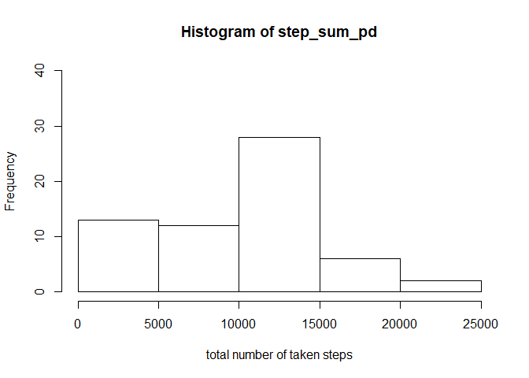
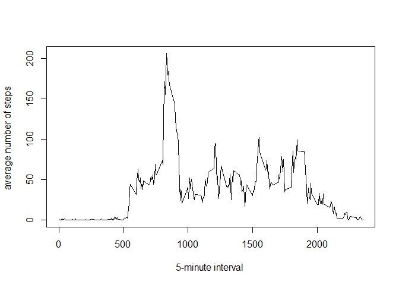
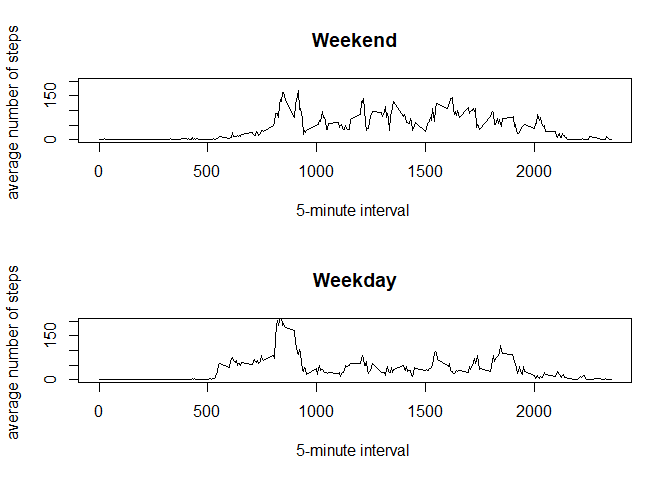

## Loading and preprocessing the data

The "lubridate" library is used to handel with dates. 


```r
df <- read.csv("activity.csv")

library(lubridate)
```

```
## 
## Attaching package: 'lubridate'
```

```
## The following object is masked from 'package:base':
## 
##     date
```

```r
df$date <- ymd((df$date))
```

## What is mean total number of steps taken per day?

### 1. Calculate the total number of steps taken per day

```r
step_sum_pd <- with(df,tapply(steps, date, sum, na.rm = TRUE))
```

### 2. Make a histogram of the total number of steps taken each day

```r
hist(step_sum_pd, xlab = "total number of taken steps", ylim = c(0,40))
```

<!-- -->

### 3. Calculate and report the mean and median of the total number of steps taken per day


```r
mean(step_sum_pd)
```

```
## [1] 9354.23
```

```r
median(step_sum_pd)
```

```
## [1] 10395
```


## What is the average daily activity pattern?

### 1. Make a time series plot of the 5-minute interval (x-axis) and the average number of steps taken, averaged across all days (y-axis)


```r
int_ave <- with(df, tapply(steps, interval, mean, na.rm = TRUE))
plot(as.numeric(names(int_ave)), int_ave, type = "l", xlab = "5-minute interval ",
     ylab = "average number of steps ")
```

<!-- -->

### 2. Which 5-minute interval, on average across all the days in the dataset, contains the maximum number of steps?


```r
names(which.max(int_ave))
```

```
## [1] "835"
```

## Imputing missing values

### 1. Calculate and report the total number of missing values in the dataset

```r
sum(is.na(df$steps))
```

```
## [1] 2304
```

### 2. Devise a strategy for filling in all of the missing values in the dataset. The strategy does not need to be sophisticated. For example, you could use the mean/median for that day, or the mean for that 5-minute interval, etc.
I used the mean for that 5-minute interval to fill the NAs. 

### 3. Create a new dataset that is equal to the original dataset but with the missing data filled in.

```r
df_new <- df

for (i in 1:nrow(df_new)) {
  if(is.na(df_new$steps[i])){
    df_new$steps[i] = int_ave[as.character(df_new$interval[i])]
  }
}
```

### 4. Make a histogram of the total number of steps taken each day and Calculate and report the mean and median total number of steps taken per day. Do these values differ from the estimates from the first part of the assignment? What is the impact of imputing missing data on the estimates of the total daily number of steps?

```r
step_sum_pd_new <- with(df_new,tapply(steps, date, sum))

hist(step_sum_pd_new, xlab = "total number of taken steps (no NA)", ylim = c(0,40))
```

<!-- -->

```r
mean(step_sum_pd_new)
```

```
## [1] 10766.19
```

```r
median(step_sum_pd_new)
```

```
## [1] 10766.19
```
Both the histgram and the mean and median values changed. By just ignoring the NA values in 
the steps column the sum of day with lower number of steps is higher than the time we replace NAs with an average value. Comparing the hist plot of the two cases the number of days with number of steps between 0-5000 and 10000-15000 is decreased and increased, respectively.


## Are there differences in activity patterns between weekdays and weekends?

### 1. Create a new factor variable in the dataset with two levels – “weekday” and “weekend” indicating whether a given date is a weekday or weekend day.

```r
fval <- weekdays(df_new$date)
fval_n <- sapply(fval, function(x){if(x=="Saturday" || x=="Sunday"){x="Weekend"}else{x="Weekday"}})
factor <- factor(fval_n)
df_new$factor <- factor
```

### 2. Make a panel plot containing a time series plot  of the 5-minute interval (x-axis) and the average number of steps taken, averaged across all weekday days or weekend days (y-axis)

```r
df_wday <- subset(df_new, df_new$factor == "Weekday")
df_wend <- subset(df_new, df_new$factor == "Weekend")

int_ave_wday <- with(df_wday, tapply(steps, interval, mean))
int_ave_wend <- with(df_wend, tapply(steps, interval, mean))

par(mfrow=c(2,1))

plot(as.numeric(names(int_ave_wend)), int_ave_wend, type = "l", xlab = "5-minute interval ",
     ylab = "average number of steps ", main = "Weekend", ylim = c(0,200))

plot(as.numeric(names(int_ave_wday)), int_ave_wday, type = "l", xlab = "5-minute interval ",
     ylab = "average number of steps ", main = "Weekday", ylim = c(0,200))
```

<!-- -->

There is a difference between weekday and weekend. 
